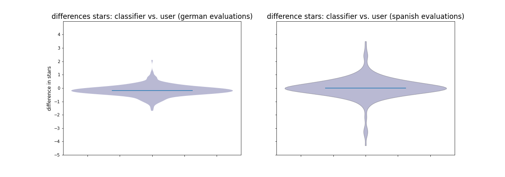
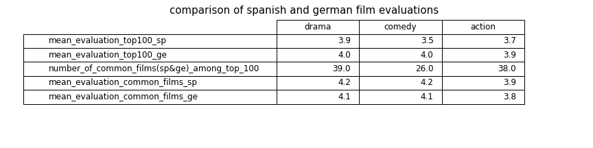

# -ih_datamadpt0420_project_final

## 1) Topic

NLP project in Spanish and German - film evaluations:

The following issues will be analysed:

How well works the sentiment analysis in the spanish and german language?

Are there any differences in the evaluation of films in Spain and in Germany?

## 2) Process

**a) Data aquisition**

From a spanish and a german websited the evaluation of 600 films were analysed (100 most popular films (of that website) in each language and each of the following categories: drama, comedy and action)

The following information were extracted:

* _written evaluation_
* _number of stars given by the users_ 

Technical realization (After analysing the website, a program (Python, Pandas, Regex) was written, to scrap (Beautiful Soup) automatically the evaluations of the films in each category).With that program, the number of films resp. the number of film categories to scrap can be easily increased. For answering above question in this analysis the scraping was limited to 600 films. 

**b) Data classification with sentiment-analysis**

The following multilingual model:  nlptown/bert-base-multilingual-uncased-sentiment was downloaded 
It is a pre-trained sequence classification model, that predicts labels (stars 1-5) to a given text. 

A program was written to label all the written evaluations with this model, so that for every film a star evaluation given by the user and a star evaluation of the same
text with the classifier is available. 

**c) Comparison of evaluation of films**

Films which are identical in the 100 best valued films in each language and of each category are extracted and compared.(Python, dicctionary and list comprehension)

## 3) Results

**a) Comparison of user evaluation and evaluation with the classifier**

The sentiment analysis works pretty well in both languages. In enclosed table you can see, that there is nearly no difference in the star evaluation of the users 
in comparison to the star evalution gained with the classification model. 

In the following analysis only the star evaluation of the classifier will be used. 

**b) Differences in film evaluations on the spanish and the german website**

The choice of the 100 top films in the categories (drama, comedy and action) are different on the spanish and the german website. 

Only about one third of the considered films are identical on the spanish and the german website. This result is similar for
all three categories. The evaluation for the films which are identical on both websites do not differ so much. 

**c) Comparison of films**

